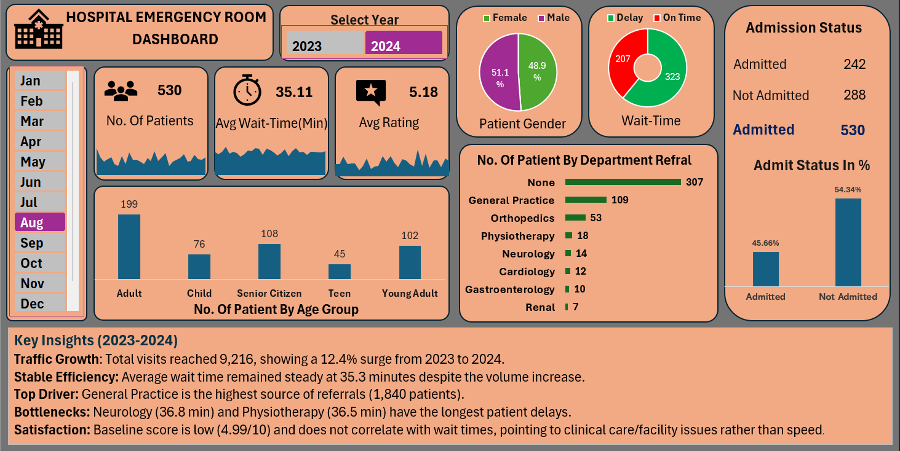

# 🏥 Hospital Emergency Room (ER) Performance Dashboard 🩺

## 📌 Project Overview
This end-to-end business intelligence project delivers a professional operational audit of a Hospital Emergency Room (ER) using a dataset of **9,216 unique patient records** spanning across 2023 and 2024. 📊

The objective of this framework is to monitor core healthcare Key Performance Indicators (KPIs)—tracking patient volume fluctuations 📈, triage waiting efficiencies ⏳, departmental bottlenecks 🚨, and care-quality satisfaction metrics ❤️—to drive actionable, data-backed administrative solutions.

---

## 📂 Repository File Architecture
Click on any of the organized project components below to navigate directly to the verified source files:

* 📊 **[Raw Patient Dataset (CSV)](/data/hospital_er_data.csv)** — The raw data source containing demographic, scheduling, and clinical tracking rows before ETL processing.
* 📈 **[Interactive Dashboard Worksheet (Excel)](/dashboard/Emergency_Room_Dashboard.xlsx)** — The primary working application containing cleaned data streams, Power Pivot relational data models, custom DAX measures, and the main interactive user interface.
* 📑 **[Executive Insights & Strategic Recommendations (PDF)](/documentation/ER_Dashboard_Insights_Summary.pdf)** — A formal, deeply detailed business report outlining comprehensive statistical observations and high-impact administrative solutions.

---

## 🛠️ Data Engineering & Analytical Tech Stack
* **🧹 Advanced Data ETL (Power Query):** Executed string standardizations, structured date-time attributes to eliminate temporal data fragmentation, and resolved empty evaluation fields within satisfaction records.
* **🧠 Data Modeling & Power Pivot:** Developed a relational star-schema data model by constructing a dedicated temporal Calendar Table to map multi-year timeline variables seamlessly.
* **🧪 DAX Formulation (Data Analysis Expressions):** Engineered custom measures to calculate dynamic running averages for patient waiting intervals and satisfaction baseline variables.
* **🎨 Business Intelligence UI Layout:** Arranged clean, functional grid containers utilizing advanced Pivot architectures, interconnected KPI cards, and dynamic timeline slicing controls.

---

## 💡 Executive Insights & Strategic Recommendations Summary

📈 Click to expand: High-Level Operational Insights

* **Traffic Volume Seasonality:** Total patient volume grew by **12.4% year-over-year**. Historical volume peaks consistently during the late Q3 window, with **August** representing the highest traffic strain.
* **Throughput Efficiency:** The global baseline wait time stands steady at **35.26 minutes**. Despite handling significantly heavier traffic in 2024, the aggregate waiting delta escalated by a mere 26 seconds.
* **Structural Bottlenecks:** **Neurology** (36.8 min) and **Physiotherapy** (36.5 min) register the longest waiting delays despite handling low volume numbers, indicating internal process friction rather than overcrowding.
* **Off-Peak Inefficiency Paradox:** In February, patient volume hit its lowest point, yet wait times peaked at **36.67 minutes**, revealing major administrative gaps during off-peak shifts.
* **Satisfaction Disconnect:** Baseline satisfaction is low at **4.99/10**. Statistical testing shows near-zero correlation between wait times and patient scores, proving that satisfaction issues stem from care quality rather than processing speed.

🎯 Click to expand: Strategic Business Recommendations

* **Dynamic Staffing Matrix:** Scale up shift counts for nurses and triage officers by **15% to 20%** during the high-demand months of late Q3 (August).
* **Off-Peak Operational Audit:** Launch an immediate process review for the month of February to eliminate scheduling gaps and slow shift handoffs during low-volume periods.
* **Intake Re-engineering:** Introduce dedicated specialized intake tracks or on-call consultants for **Neurology** and **Physiotherapy** to bypass general ER lines and clear traffic jams.
* **Experience Pivot:** Reallocate secondary operational budgets from speed-optimization toward care-quality training and clinical upgrades, focusing heavily on the low-scoring **Renal** department.

👉 **[Click here to view the full, deeply detailed Executive Insights & Recommendations PDF Report](/documentation/ER_Dashboard_Insights_Summary.pdf)**

---

## 🚀 How to Replicate and Interact with the Dashboard
1. Download or clone the **[Emergency Room Dashboard.xlsx](/dashboard/Emergency_Room_Dashboard.xlsx)** file located within the dashboard folder.
2. Launch the workbook via Microsoft Excel (Excel 2021 or Microsoft 365 desktop versions recommended for native slicer connectivity). 💻
3. If prompted by Excel security bars, select **`Enable Content`** to allow the underlying Power Pivot relational data cubes to initialize properly. ☑️
4. Utilize the **Year** and **Month** slicer buttons placed on the dashboard interface to interactively query the visual elements instantly. 🎛️

---

## 👤 About the Developer
I am a career-starter Data Analyst specializing in building clean data pipelines, developing robust relational models, and designing intuitive business intelligence tracking layouts. My work focuses on translating chaotic, unformatted raw records into highly structured, clear visual stories that help stakeholders make confident, strategic decisions. 🚀
